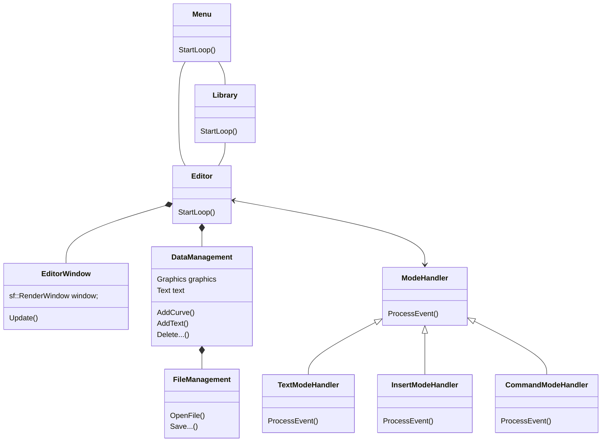

# Scrifuco - documentation

[TOC]

---

##  Introduction

Scrifuco *(from latin words Scribe and Fuco)* is a graphical-text editor used for simple note-taking.

It's objective is to provide enough tools for typically lecture without unnecessary complexity.
One of Scrifuco key concepts is grouping note `documents` into so called `libraries`.

## User guide

### Installation

#### Windows

You should be able to use simply CMake which on Windows requires MinGW, or you can open the Visual studio folder with solution the standard way and it should be plug and play.

#### Linux

Only prerequisite is to have [SFML](https://www.sfml-dev.org/) installed, so for example `sudo apt-get install libsfml-dev` and then the installation process is simple as:

```bash
# sudo apt-get install libsfml-dev
# git clone <this repository>
cd veselmi7/scrifuco
mkdir build
cd build
cmake ..
make
./Scrifuco
```

### Usage

If you only want a quick demo - it is provided [here](https://drive.google.com/file/d/1vGwwkzLh-dmUUPC8Ntp8IJtSThrU3qNv/view?usp=sharing).

The usage of the program consists of interaction with three separate parts:

#### Menu

Upon opening the program start in a menu from which you have the ability to quickly create a new document (so called quick mode), open already existing document, create a new library or open an existing one. You also as always have the ability to switch in which mode you will open editor or as always you can just exit.

#### Library

There isn't much to do in a window representing library. You can either create a new document, open it or remove it from a library. Interesting is that you don't have to rely on limited interface to edit the library as it is simply a text document listing all it's containing documents.

#### Editor

The key element of the program. 

The control depends in which mode you open the editor.

##### Standard mode

This mode is definitely more user-friendly. You also have the ability to save the file by button in the middle of the lower part of the screen, in case you have created a new file there will be a dialog allowing you to select the name and location of the saved document. More importantly you can edit the contents of the document, this is achieved by two modes:

* `Hybrid mode` - in this mode you are able not only to write text but also to draw, erase, select and move curves.

* `Text mode `- in this mode you can solely edit the text, select parts of it and copy/paste.

##### Advanced mode

First two modes are same (even though `Hybrid mode` is now `Insert mode`), but there is a new `Command mode` in which you:

* Move by typing `h`, `j`, `k`, `l` or using arrows
* Remove a character by pressing `x` or remove a line by pressing `d`
* To switch to insert mode, press `i` or `a`, to switch to text mode, press `t` and to switch back use `escape`
* Use commands by typing `:` followed by the command and pressing enter

``` Scrifuco Commands
:help - shows help

:q - quit
:q! - quit without saving
:w - save
:wq - save and quit

:name <name> - set the name of the file

:font <size> - set font size
:spacing <size> - set line spacing
:margin <size> - set margin size

:fs - fullscreen
:res <width> <height> - set resolution
:titlebar - show/hide titlebar

:dark - dark mode
:light - light mode

:settings - export the current settings to Scrifuco.ini file
```

Another difference is that you have to go through command mode to switch modes.

## Technical documentation

For creating an editor that allows you to write text and draw images, I used **SFML**, which provides a simple interface to the various components of the computer. Using SFML also affect the program structure as the most crucial interaction with the SFML was using one entity called window. 

Below you can see a very simplified **class diagram**:


### The program flow overview

*Files:* `Main.cpp`

Execution of the program starts with constructing `Menu` and calling its function `StartLoop()`. The loop within the class is the same as any standard main event loop. While the program is running, it actively polls events and reacts accordingly.

If any buttons is pressed, it's function `OnClick()` is called (that function is created from constructor of the button).  
The following options are possible:

* **Quick mode** - `Menu` is closed and you are taken to `Editor`
* **Open document** - `Menu` is not closed and there is new `Editor` created from selected file in a new thread
* **Create library** and **Open library** - the `menu` is not closed and there is new `Library` created from selected file in a new thread
* **Exit** - ...

### Menu and library details

*Files:* `Menu.h`, `Menu.cpp`, `Library.cpp`, `Library.h`

`Menu` and `Library` are very similar, they both create elements which they are going to display in a constructor, load their settings from a `Settings` singleton and have a `StartLoop()` function which regularly calls `Update()`.

#### Initialization

First a `sf::RenderWindow` is created, then two vectors are populated - `buttons_` with `unique_ptr<Button>`  and `elements` with `unique_ptr<DisplayElement>` (the primary reason for using pointers is that both classes are abstract).

Creating the buttons is done using few constants from a `constants.h` file and lambda functions. Those lambda functions usually looks like this:

```C++
[this](){
    threads_.emplace_back(std::thread([this](){
        std::string file_name = FileManagement::OpenFileDialog(SELECT_DOCUMENT_DIALOG, DOCUMENT_FILTER);
        if (file_name.empty()) return;

        Editor editor{file_name, file_name};
        if (!editor.Initialized) return;
        editor.StartLoop(this->dualSwitch_->IsRightSelected());
    }));
}}
```

They are provided with reference to the `Menu` or `Library`. In this case the only content of the lambda function is a creation of a new thread with `Editor` from `OpenFileDialog`.

The size of the menu is fixed, so the buttons don't have to be created again.

#### Update()

In each `Update()` a new event is polled, and in simple `if, else` statement is decided whether it's a click affecting closing the window or clicking any of the buttons or whether it's a mouse move making mouse cursor hover over any of the buttons.

#### Threads

During lifetime, they can create numerous threads, which are always added to a vector so the destructor can wait for them by calling `join()`.

### Settings

*Files:* `Settings.h`, `Settings.cpp`

All the details of the editor view are stored in this singleton. The details are following:

```C++
std::string Title;
unsigned int ScreenWidth;
unsigned int ScreenHeight;
unsigned int FontSize;
float LineSpace;
unsigned int Framerate;
unsigned int Antialiasing;
sf::Color BackgroundColor;
sf::Color FontColor;
sf::Color SelectionColor;
std::string FontPath;
sf::Font Font;
float OffsetX;
float OffsetY;
float CursorOffsetY;
float scrollThresholdPercentage; // threshold for cursor to scroll down the screen
const sf::Time CursorDelay;      // duration for cursor blinking
float buttonSquareSize;
float buttonSpacing;
float buttonMargin;
float buttonSizeDiff;
```

### Other constants

*Files:* `Constants.h`

The details from previous section are initialized with either a `settings.ini` file or a pre-saved constants which are for easier maintainability located in a `constans.h` file.

### Display elements

*Files:* `DisplayElements.h`, `DisplayElements.cpp`

To simplify drawing buttons, switches, labels and similar items (mostly in `Menu` and `Libraray` window) I created a file containing all of them. Initialization of most of these is rather simple and required parameters you can see inside the code. Usually they require a lambda function that returns `void` to execute something. 

### Editor details

*Files:* `Editor.h`, `Editor.cpp`,`EditorWindow`, `EditorWindow.cpp`

The most complex part of the program. I decided to separate the `Edtior` logic such as to start or to handle an event and it's representation. It can be almost considered as some sort of a bridge design pattern. 

Anyway the `Edtior` actively polls events and using a strategy pattern it handles them. The result of each of such event is visible upon calling an `Update` on `EditorDisplay` class. Strategy pattern means that I have three different handlers (according to selected mode - `Inesrt`, `Text` and `Command`) with common parent `ModeHandler`, which are able to `ProcessEvent(const sf::Event &event)`, even though some base event handling is done already in the `Editor` class,

#### Possible events and event handling

*Files:* `EventHandlers.h`, `CommandHanler.cpp`, `InsertHandler.cpp`, `TextHandler.cpp`

The events are usually one of three types

* Window handling - close, resize, ...
* Text insert or mouse events while in Insert mode or Text mode
* Command insert in Command mode

The first type is quite simple as their processing takes just a few lines of code

##### Text insertion and mouse events

On button pressed events, I have to check whether the pressed key is an escape, tab, backspace, ... or just regular text. Based on that, I can call the corresponding functions from the `DataManagment` class.

Similarly, I must check whether the user pressed the mouse button before mouse events. If not, I will initialize a new line of text; in the other scenario, I have to add the mouse's current position to the currently drawn line.

##### Commands

One of the challenges was how to solve command execution, as there aren't many commands I decided that I don't want any overkill solution and settle with `map<std::string, std::functio<void(std::string)>>`. So whenever the `Enter` key is pressed with active command buffer, the command is found in map in executed.

If there is any problem, the user is informed by notification in the command buffer.

#### Storing and editing data in memory

*Files:* `DataRepresentation.h`, `DataRepresentation.cpp`, 

The data are represent quiet simply. The text is a `vector` of `string` and the curves have their own class which consist of information about the color, thickness and list of all points which are defining the curve. These curves are then also saved into a vector. 

This simple representation assures that the editing is also simple. On a mouse button press the curve is started being drawn with current settings and the coordinates of the mouse are recorded. Similarly simple is the text editing as thanks to the `TextCursor` class I can easily put inserted `char` into an already existing string in the mentioned vector.

#### Text Curosr

*Files:* `TextCursor.h`, `TextCursor.cpp`

The text cursor is moved with each inserted char but can be also controlled with arrows or placed by a mouse. Meaning I just have to check before moving the cursor whether the move is legal and if not, just fix it on the closest allowed space.

#### Saving data to a storage

*Files:* `DataManagement.h`, `DataManagement.cpp`, `FileManagement.cpp`

The already mentioned data representation provides me with a simple storing. As I haven't created a binary saving option yet, you have to save the files in format partially similar to XML meaning it's just a text document and at the end there is information about all the curves.

The problem with this module is that I have to use `windows.h`, creating problems with portability. This was done to create a simple file dialog for the user and may change in the future.