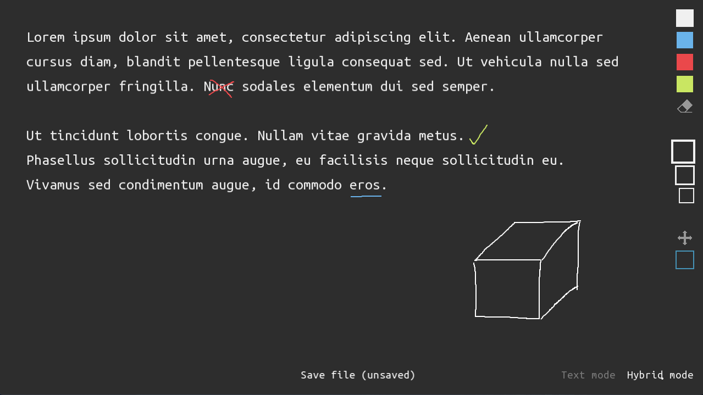

# Scrifuco 🖌

# CURRENTLY BROKEN BECAUSE OF ZAVORAL...

## What is Scrifuco?

Graphical-text editor with a bit of VIM-like key bindings

### Preview



### How to use it?

First you have to open or create a `document` (a text file with graphics).
These files can be either standalone or part of a `library`.

You have the ability to open the `document` in two modes: `standard` and `advanced`.

### Standard mode

There are two ways of interaction inside it - **Text mode** and **Hybrid mode**

* In text mode, you can mainly edit and select text.
* In hybrid mode, you can also edit text, but you have the added ability to draw, erase, select and move graphics.

### Advanced mode

*Disclaimer: Recommend if you are familiar with VIM*

There are three different modes with different behaviors.

#### Command mode

* Move by typing `h`, `j`, `k`, `l` or using arrows
* Remove a character by pressing `x` or remove a line by pressing `d`
* To switch to insert mode, press `i` or `a`, to switch to text mode, press `t` and to switch back use `escape`
* Use commands by typing `:` followed by the command and pressing enter

##### Commands

```
:help - shows help

:q - quit
:q! - quit without saving
:w - save
:wq - save and quit

:name <name> - set the name of the file

:font <size> - set font size
:spacing <size> - set line spacing
:margin <size> - set margin size

:fs - fullscreen
:res <width> <height> - set resolution
:titlebar - show/hide titlebar

:dark - dark mode
:light - light mode

:settings - export the current settings to Scrifuco.ini file
```

#### Insert mode

* Type text and use your mouse to draw
* Right click and drag mouse to erase
* You can also switch to different colors, change size of the brush and use select tool or move tool.

#### Text mode

* Use it as your typical basic text editor

## How to install

There is a standard CMake, so it shouldn't be problem.

### On Windows

Use precompiled binary in folder WinRelease.

### On Linux

[SFML](https://www.sfml-dev.org/) is needed, so for example `sudo apt-get install libsfml-dev` and then

```bash
# sudo apt-get install libsfml-dev
# git clone <this repository>
cd veselmi7/scrifuco
mkdir build
cd build
cmake ..
make
./Scrifuco
```

### On MacOS

To be found out...

## External libraries

* [SFML](https://www.sfml-dev.org/) - multi-media interface
* [SelbaWard](https://github.com/Hapaxia/SelbaWard) - used for drawing Splines

## Future plans

- [ ] Text wrapping
- [ ] Better undo/redo
- [ ] Own drawing of splines
- [ ] Variable font size per row
- [ ] Markdown support

## Known bugs

SelbaWard is problematic with higher resolution - splines are drawn with spaces (hence own drawing of splines TODO)
